# Visual Learning Guide

Deploy a MAF (Microsoft Agent Framework) Agent with a AGT (Agent Governance Toolkit) sidecar and a lightweight frontend exposed publicly through AKS (Azure Kubernetes Service).

No prior knowledge on MAF, AGT or AKS required! This is a beginner friendly guide to learn all of it.

## Pre-requisites

- azure cli - [Download](https://learn.microsoft.com/en-us/cli/azure/install-azure-cli)
- azure account - [Portal](https://portal.azure.com/)
- uv - [Download](https://docs.astral.sh/uv/getting-started/installation/)
- python 3.11+ - [Download](https://www.python.org/downloads/)
- kubectl - [Download](https://kubernetes.io/docs/tasks/tools/)

## Get started

> [!NOTE]
> We are going for a minimal AKS config for learning purposes. In production, you would dive much deeper into specific configurations.

First we need to set up a resource group on azure, this will be the place where we will deploy every service.

Go to [Azure Portal](https://portal.azure.com) to get started.

Click on `Resource Groups`

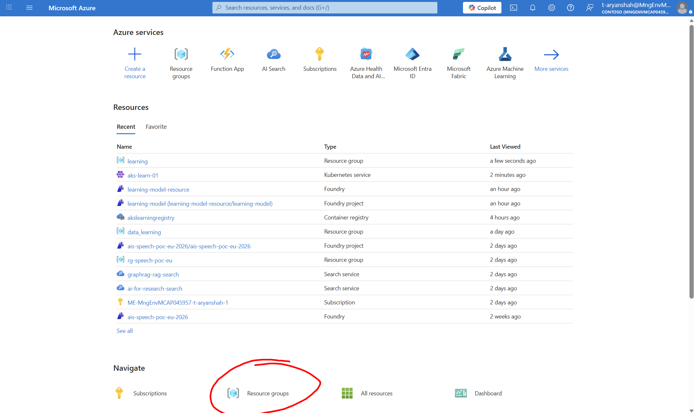

Click on `Create`

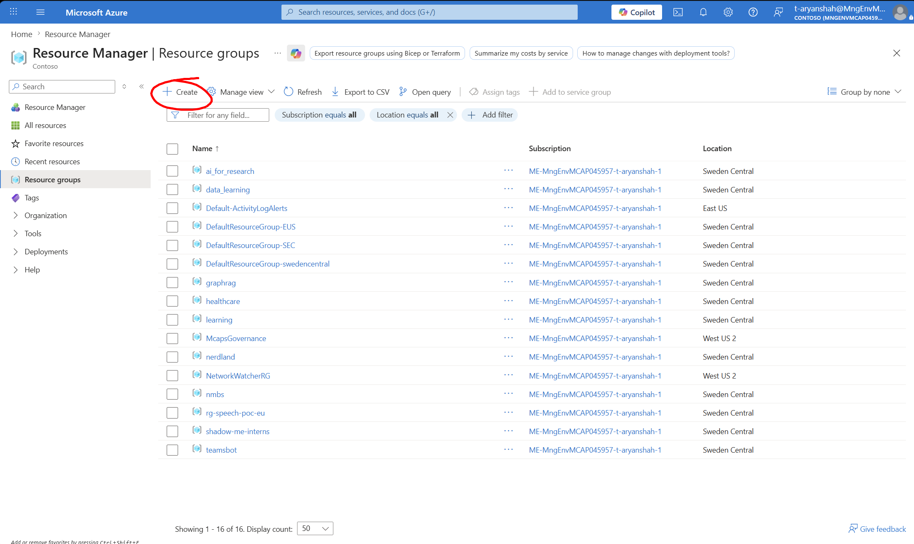

Give a resource name like `akslearning`

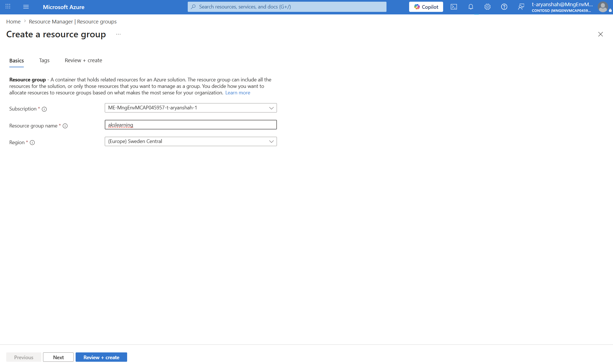

Review and create the resource group.

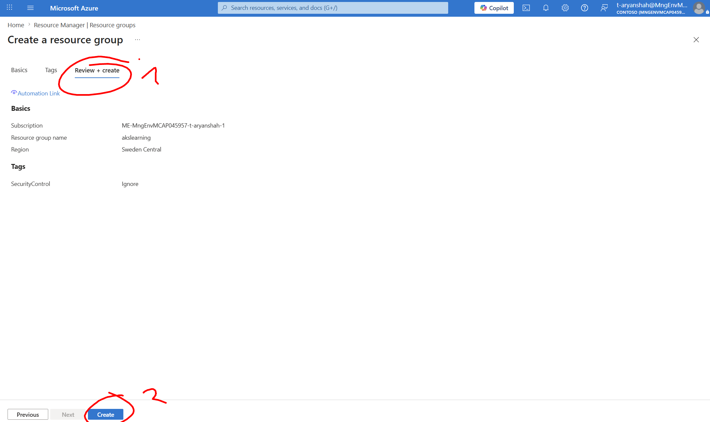

Go to your newly created resource group

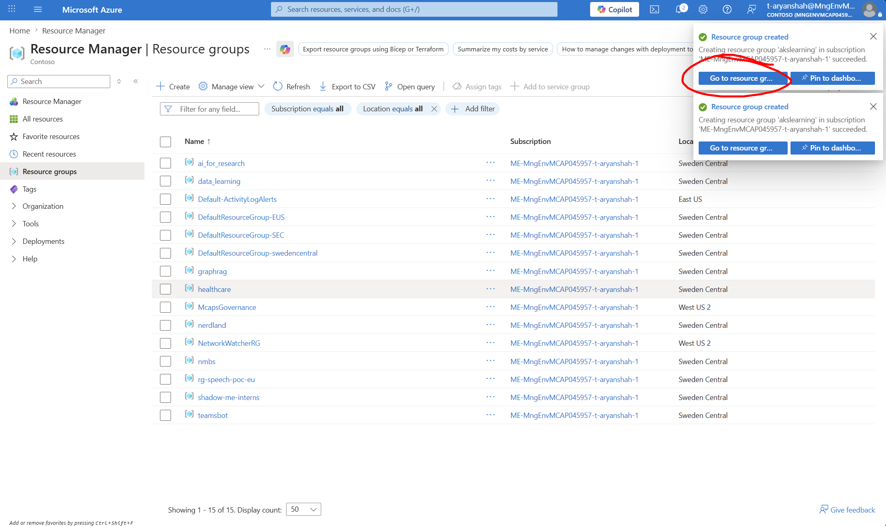

Now we will create our services here, starting with AKS. Hit `Create`

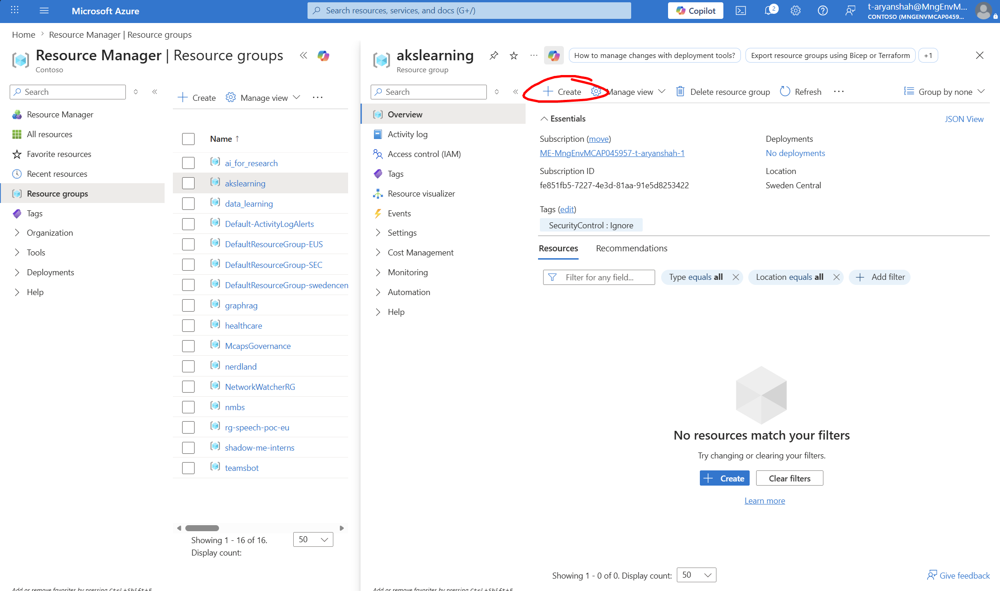

Enter AKS deployment config page

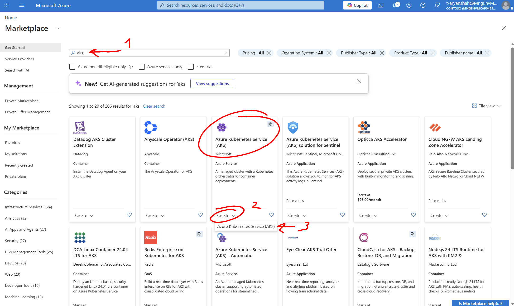

Fill in these details for `Basics`

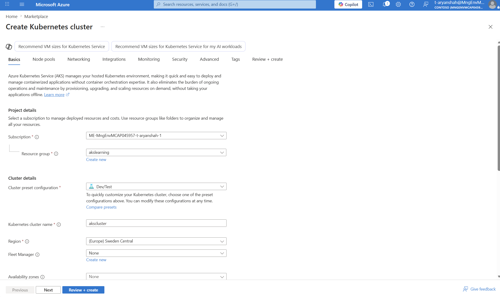
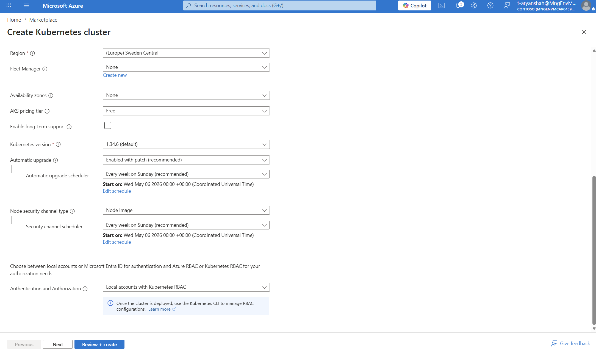

In AKS, a node pool is a group of Kubernetes nodes with the same VM configuration. These nodes provide the compute capacity where your pods run.

Simple analogy: 1 node = 1 Azure VM, and 1 node pool = a group of similar VMs.

By default, the size of the node pool created is quite big, this makes sense because AKS is meant for serious applications that will deal with large scale. For us, we need a smaller node pool config since we will be deploying a relatively light setup.

Let's change it, first click on the SKU of the node pool

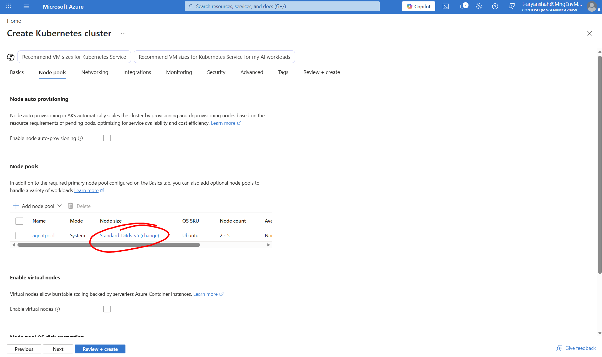

Scroll down till you find SKU

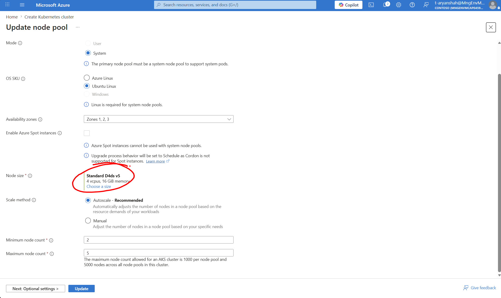

Select the cheapest one available that is compatible with our setup

With autoscaling, you define a minimum and maximum range, and AKS scales the node pool within that range when your workloads need more or less capacity. With manual scaling, you choose the number of nodes yourself, which can be risky if you underestimate workload demand, because AKS may not have enough node capacity to schedule all pods, leaving some pods stuck in a `Pending` state. Autoscaling helps reduce this risk, but setting the maximum too low can still limit how far the node pool can grow.

For our setup we will leave it as default on autoscaling between the default min/max values.

We can skip the `Networking` tab for this learning setup because the default AKS networking options are enough for a simple public demo. For more advanced use cases, this tab is worth configuring because it controls things like virtual networks, pod/service IP ranges, private cluster access, outbound traffic, and network policies.

For now, think of it this way: AKS nodes run inside an Azure virtual network, and Kubernetes adds its own networking layer so pods and services can talk to each other. Later, when we expose the frontend publicly, Kubernetes will create an Azure load balancer that routes public traffic into the cluster.

Next, for `Integrations`, we do not need anything here at the moment, and these options can be configured later. This tab is useful for connecting services like Azure Container Registry, monitoring, or security features. For this guide, we will build our container images manually, push them to a container registry, and then deploy them to AKS.

Let's go to the next phase, `Monitoring`, it's is important to understand what's going on in AKS. It's highly recommended to have 2 things enabled here:

- Container Insights (Container Logs with Log Analytics) -> Application logs (errors, warnings, ...)
- Managed Promotheus -> Resource related metrics (CPU, Memory, ...)

Optionally enable Grafana for advanced dashboarding for monitoring. I will also be disabling `Alerts` so I don't get spammed with emails, but best to leave this on so that the team can be notified if the service detected that something is off from the monitoring metrics.

In `Security`, Microsoft Defender is recommended to be enabled as AKS will in most cases be used for scale, having Defender in place gives good protection by default.

We can keep the defaults here for the rest. `Workload identity` is if you want to scope permissions to a Kubernetes service instead of a Node in general, for enhanced control, this is usually used in production. For our setup, we will not be using workload identities. `Image Cleaner` makes sure old images get cleaned up automatically so that old unsecure images don't exist for attackers to potentially exploit.

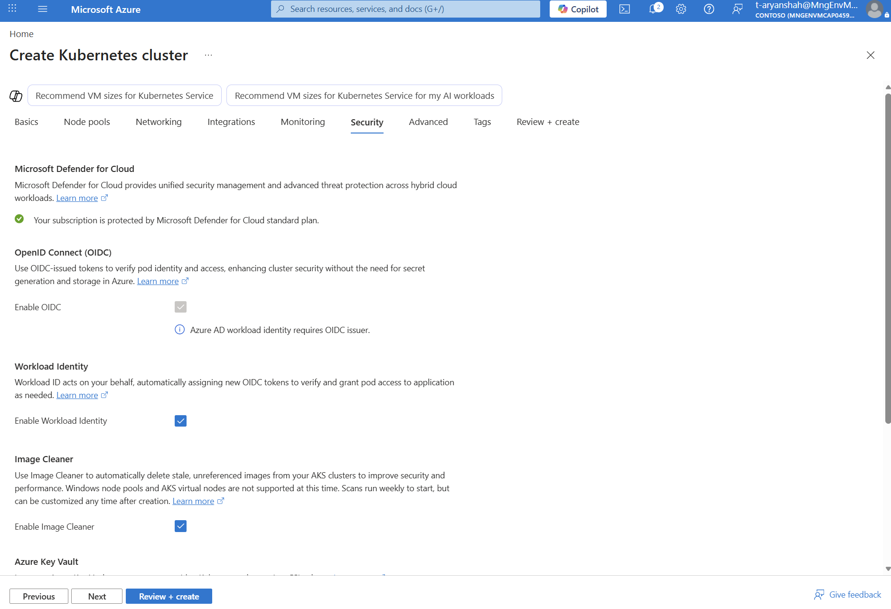

Now, skip directly to `Review + Create`. Click on `Create` and that's done for the AKS setup!

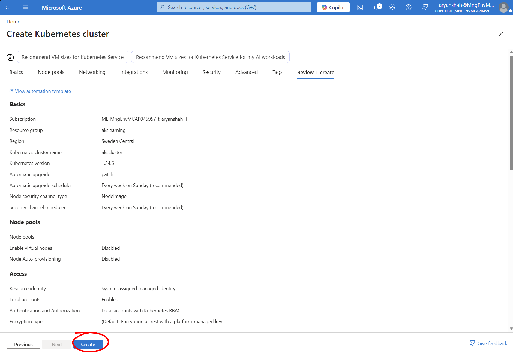
